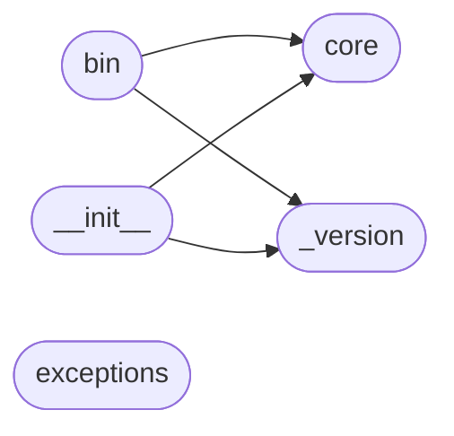

# Code Overview

[_Documentation generated by Documatic_](https://www.documatic.com)

<!---Documatic-section-Codebase Structure Python-start--->
## Codebase Structure Python

The codebase has a flat structure, with 6 code files.

<!---Documatic-block-system_architecture-start--->

<!---Documatic-block-system_architecture-end--->

# #
<!---Documatic-section-Codebase Structure Python-end--->

<!---Documatic-section-Key Infrastructure-start--->
## Key Infrastructure

### AWS is used in:

* `__init__` of `apilogs.core.AWSLogs`

# #
<!---Documatic-section-Key Infrastructure-end--->

<!---Documatic-section-Key Objects-start--->
## Key Objects

There are exposed imports at level-0
from the source directory (apilogs)

<!---Documatic-block-apilogs-start--->

	
<code>apilogs</code> (Click to Expand!)

* `apilogs._version.__version__`
* `apilogs.core.AWSLogs`

<!---Documatic-block-apilogs-end--->

# #
<!---Documatic-section-Key Objects-end--->

<!---Documatic-section-Important Functions-start--->
## Important Functions

<!---Documatic-block-important_funcs-start--->
<!---Documatic-block-most_used_funcs-start--->
### Most Utilised Functions

* apilogs._version.__version__ (2 times)
<!---Documatic-block-most_used_funcs-end--->

<!---Documatic-block-end_user_funcs-start--->
### End User Exposed Functions

* apilogs._version.__version__
* apilogs.core.AWSLogs
<!---Documatic-block-end_user_funcs-end--->
<!---Documatic-block-important_funcs-end--->

# #
<!---Documatic-section-Important Functions-end--->

<!---Documatic-section-Class Hierarchy-start--->
## Class Hierarchy

<!---Documatic-block-apilogs.exceptions.BaseAWSLogsException-start--->

	
<code>apilogs.exceptions.BaseAWSLogsException</code> (Click to Expand!)

* apilogs.exceptions.NoStreamsFilteredError
* apilogs.exceptions.TooManyStreamsFilteredError
* apilogs.exceptions.UnknownDateError

<!---Documatic-block-apilogs.exceptions.BaseAWSLogsException-end--->

<!---Documatic-block-object-start--->

	
<code>object</code> (Click to Expand!)

* apilogs.core.AWSLogs

<!---Documatic-block-object-end--->

# #
<!---Documatic-section-Class Hierarchy-end--->

[_Documentation generated by Documatic_](https://www.documatic.com)