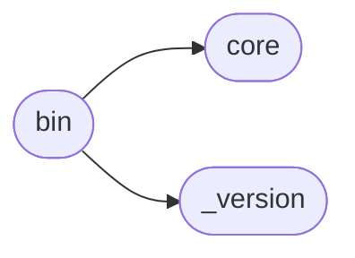

# Apilogs Bin

[_Documentation generated by Documatic_](https://www.documatic.com)

<!---Documatic-section-Codebase Structure-start--->
## Codebase Structure

<!---Documatic-block-system_architecture-start--->

<!---Documatic-block-system_architecture-end--->

# #
<!---Documatic-section-Codebase Structure-end--->

<!---Documatic-section-apilogs.bin.main-start--->
## [apilogs.bin.main](3-apilogs_bin.md#apilogs.bin.main)

<!---Documatic-section-main-start--->
<!---Documatic-block-apilogs.bin.main-start--->
<details>
	<summary><code>apilogs.bin.main</code> code snippet</summary>

```python
def main(argv=None):
    if sys.version_info < (3, 0):
        sys.stdout = codecs.getwriter(locale.getpreferredencoding())(sys.stdout)
    argv = (argv or sys.argv)[1:]
    parser = argparse.ArgumentParser(usage='%(prog)s [ get | groups | streams ]')
    parser.add_argument('--version', action='version', version='%(prog)s ' + __version__)
    parser.add_argument('-v', action='count', default=0, help='increase verbosity (-vvvv for maximum)')

    def add_common_arguments(parser):
        parser.add_argument('--aws-access-key-id', dest='aws_access_key_id', type=str, default=None, help='aws access key id')
        parser.add_argument('--aws-secret-access-key', dest='aws_secret_access_key', type=str, default=None, help='aws secret access key')
        parser.add_argument('--aws-session-token', dest='aws_session_token', type=str, default=None, help='aws session token')
        parser.add_argument('--profile', dest='aws_profile', type=str, default=None, help='aws profile')
        parser.add_argument('--aws-region', dest='aws_region', type=str, default=os.environ.get('AWS_REGION', None), help='aws region')

    def add_date_range_arguments(parser):
        parser.add_argument('-s', '--start', type=str, dest='start', default='5m', help='Start time')
        parser.add_argument('-e', '--end', type=str, dest='end', help='End time')
    subparsers = parser.add_subparsers()
    get_parser = subparsers.add_parser('get', description='Get logs')
    get_parser.set_defaults(func='list_logs')
    add_common_arguments(get_parser)
    get_parser.add_argument('-a', '--api-id', dest='api_id', help='An API Gateway REST API ID')
    get_parser.add_argument('-t', '--stage', dest='stage', help='An API Gateway stage name for the deployed API')
    get_parser.add_argument('-f', '--filter-pattern', dest='filter_pattern', help='A valid CloudWatch Logs filter pattern to use for filtering the response. If not provided, all the events are matched.')
    get_parser.add_argument('-w', '--watch', action='store_true', dest='watch', help='Query for new log lines constantly')
    get_parser.add_argument('-G', '--no-group', action='store_false', dest='output_group_enabled', help='Do not display group name')
    get_parser.add_argument('-S', '--no-stream', action='store_false', dest='output_stream_enabled', help='Do not display stream name')
    get_parser.add_argument('--timestamp', action='store_true', dest='output_timestamp_enabled', help='Add creation timestamp to the output')
    get_parser.add_argument('--ingestion-time', action='store_true', dest='output_ingestion_time_enabled', help='Add ingestion time to the output')
    get_parser.add_argument('-H', '--highlight', action='append', dest='highlight', help="Highlight text found in event's message.")
    add_date_range_arguments(get_parser)
    get_parser.add_argument('--no-color', action='store_false', dest='color_enabled', help='Do not color output')
    groups_parser = subparsers.add_parser('groups', description='List groups')
    groups_parser.set_defaults(func='list_groups')
    add_common_arguments(groups_parser)
    streams_parser = subparsers.add_parser('streams', description='List streams')
    streams_parser.set_defaults(func='list_streams')
    add_common_arguments(streams_parser)
    add_date_range_arguments(streams_parser)
    streams_parser.add_argument('log_group_name', type=str, help='log group name')
    (options, args) = parser.parse_known_args(argv)
    configure_logging(options.v)
    if hasattr(options, 'api_id'):
        options.log_group_name = 'API-Gateway-Execution-Logs_' + options.api_id + '/' + options.stage
        options.log_stream_name = 'ALL'
    if getattr(options, 'aws_profile', None):
        os.environ['AWS_PROFILE'] = options.aws_profile
    try:
        logs = AWSLogs(**vars(options))
        if not hasattr(options, 'func'):
            parser.print_help()
            return 1
        getattr(logs, options.func)()
    except ClientError as exc:
        code = exc.response['Error']['Code']
        if code in (u'AccessDeniedException', u'ExpiredTokenException'):
            hint = exc.response['Error'].get('Message', 'AccessDeniedException')
            sys.stderr.write(colored('{0}\n'.format(hint), 'yellow'))
            return 4
        raise
    except exceptions.BaseAWSLogsException as exc:
        sys.stderr.write(colored('{0}\n'.format(exc.hint()), 'red'))
        return exc.code
    except Exception:
        import platform
        import traceback
        options = vars(options)
        options['aws_access_key_id'] = 'SENSITIVE'
        options['aws_secret_access_key'] = 'SENSITIVE'
        options['aws_session_token'] = 'SENSITIVE'
        options['aws_profile'] = 'SENSITIVE'
        sys.stderr.write('\n')
        sys.stderr.write('=' * 80)
        sys.stderr.write("\nYou've found a bug! Please, raise an issue attaching the following traceback\n")
        sys.stderr.write('https://github.com/jorgebastida/awslogs/issues/new\n')
        sys.stderr.write('-' * 80)
        sys.stderr.write('\n')
        sys.stderr.write('Version: {0}\n'.format(__version__))
        sys.stderr.write('Python: {0}\n'.format(sys.version))
        sys.stderr.write('boto3 version: {0}\n'.format(boto3.__version__))
        sys.stderr.write('Platform: {0}\n'.format(platform.platform()))
        sys.stderr.write('Config: {0}\n'.format(options))
        sys.stderr.write('Args: {0}\n\n'.format(sys.argv))
        sys.stderr.write(traceback.format_exc())
        sys.stderr.write('=' * 80)
        sys.stderr.write('\n')
        return 1
    return 0
```
</details>
<!---Documatic-block-apilogs.bin.main-end--->
<!---Documatic-section-main-end--->

# #
<!---Documatic-section-apilogs.bin.main-end--->

<!---Documatic-section-apilogs.bin.configure_logging-start--->
## [apilogs.bin.configure_logging](3-apilogs_bin.md#apilogs.bin.configure_logging)

<!---Documatic-section-configure_logging-start--->
<!---Documatic-block-apilogs.bin.configure_logging-start--->
<details>
	<summary><code>apilogs.bin.configure_logging</code> code snippet</summary>

```python
def configure_logging(verbosity):
    is_max_verbosity = verbosity > 3
    verbosity = 3 if is_max_verbosity else verbosity
    level = {0: 'ERROR', 1: 'WARNING', 2: 'INFO', 3: 'DEBUG'}[verbosity]
    fmt = '%(asctime)s %(name)s:%(lineno)s %(levelname)s: %(message)s'
    logging.basicConfig(level=level, format=fmt)
    if not is_max_verbosity:
        external_loggers = ['botocore']
        for name in external_loggers:
            logger = logging.getLogger(name)
            logger.setLevel(logging.ERROR)
```
</details>
<!---Documatic-block-apilogs.bin.configure_logging-end--->
<!---Documatic-section-configure_logging-end--->

# #
<!---Documatic-section-apilogs.bin.configure_logging-end--->

[_Documentation generated by Documatic_](https://www.documatic.com)